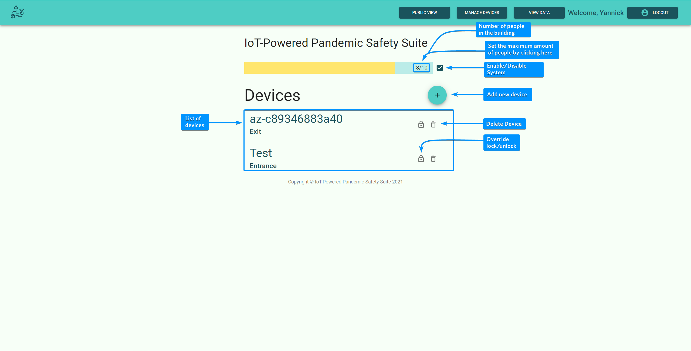
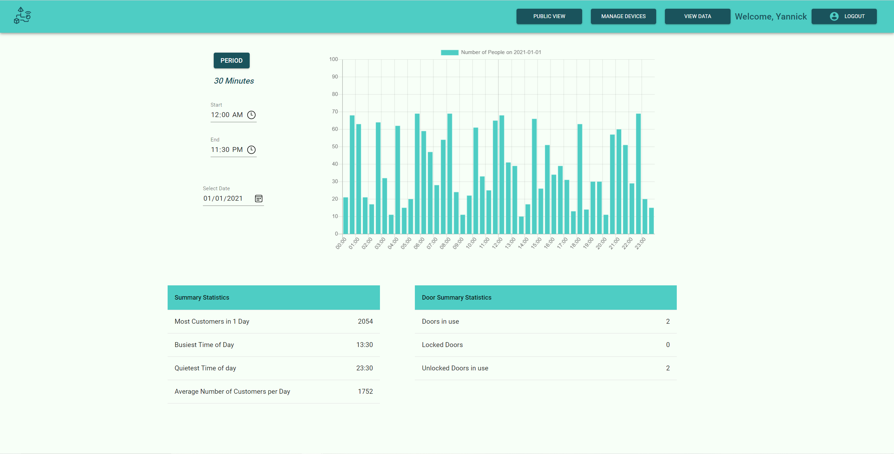

# IoT Pandemic Saftey Suite Frontend

 

Deployed on [pandemicsafetysuite.azurewebsites.net](https://pandemicsafetysuite.azurewebsites.net).

The IoT Pandemic Saftey Suite was created for the Software Engineering Group Project module with Microsoft as our client. The software system gives the ability to control the amount of people in closed spaces by counting those entering and leaving it through IoT devices.

This UI is built in React and Material UI. It allows administrators to view the connected devices, view the number of people in the building, and add/remove devices.



The administrator can also see statistics regarding the number of people in the building overtime.



There is a public view that can be accessed by any computer view URL and therefore could be put on any screen or display to show towards customers.


## Deploy to Azure

1. Fork the repository
2. Log into Azure
3. Create a New Webapp
   1. Basics
      1. Fill out the Subscription, Resource Group, & Name
      2. Select the Runtime stack to be Node 14 LTS
      3. Select Windows as the OS
      4. Select your region of choice
   2. Deployment
      1. Connect your Github
      2. Select the Org, Repo, & Branch
   3. Create the Webapp.
4. In the generated workflow, change the last line to have `package: './build'`
5. The server should now auto deploy to Azure

## Local Installation for Testing & Development

1. Install [Node.js](https://nodejs.org)
2. Clone this repository
3. Open up command prompt or teminal and navigate to the location of the cloned repository
4. Install the dependencies

   ```Shell Session
   npm install
   ```

5. Running the server locally

   ```Shell Session
   npm start
   ```

   The server should now be hosted on [http://localhost:3000](http://localhost:3000)

## Some Relevant Docs

- [Node.js](https://nodejs.org/en/docs/)
- [React](https://reactjs.org/docs/getting-started.html)
- [Material UI](https://material-ui.com/)
- [Microsoft Authentication Library](https://github.com/AzureAD/microsoft-authentication-library-for-js)
